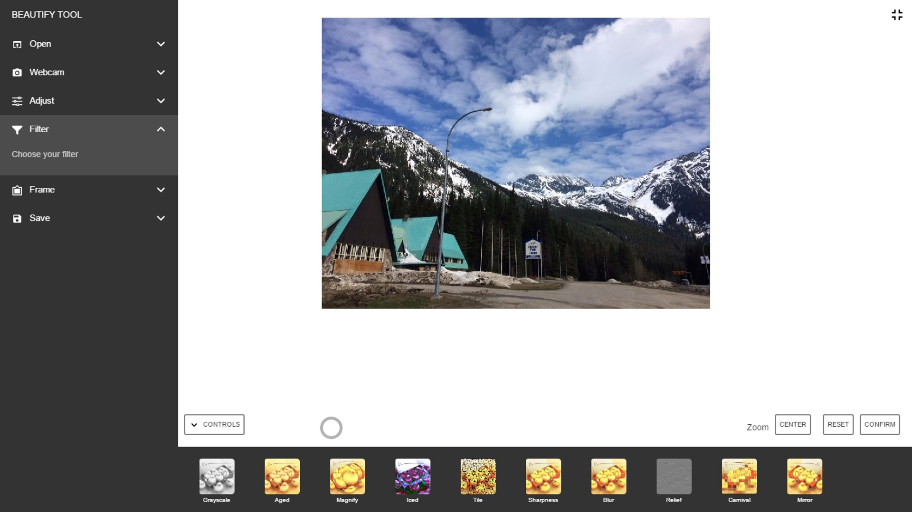

# BEAUTIFY TOOL
This javascript project adjusts parameters of photos and adds filters or frames to photos. Photos can be imported from local computer or taken using Webcam.

## Functions
* Open photos: Choose and open local photos
* Webcam: Use camera to take photos
* Adjust: Adjust parameters of the photo, including contrast, brightness, exposure, warmth and saturation
* Filter: Add filters to the photos, including gray scale, aged, magnify, iced, tile, sharpness, blur, relief, carnival and mirror
* Frame: Add frames to the photos, including blackedge, circle, rainy, flower, vintage, diamond, love, whitespot and star
* Save: Download processed image

## Screen shot

## Third Party Code Used in this Experiment
* [requirejs](http://requirejs.org/), by [jrburke](jrburke), BSD & MIT license
* [jpg-glitch](https://github.com/snorpey/jpg-glitch), by [snorpey](snorpey), MIT license

## license

[MIT License](LICENSE)

## Build Script
* Use python to set up an http server: `python -m SimpleHTTPServer 8000`
* Open `localhost:8000` in the web browser
* The webcam and frame will not work without an http server
